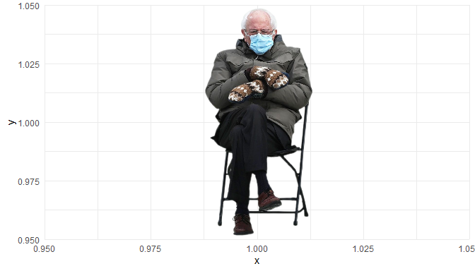
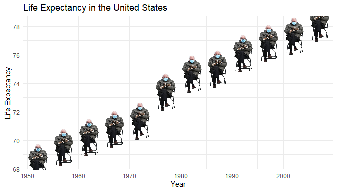

<!-- README.md is generated from README.Rmd. Please edit that file -->

# ggbernie

<!-- badges: start -->

<!-- badges: end -->

ggbernie let’s you add the dripped out Bernie Sanders from the Biden
inauguration to any ggplot.

The code is based off the [`ggtech`
package](https://github.com/ricardo-bion/ggtech) and [`ggnba`
package](https://github.com/ariespirgel/ggnba)

## Installation

You can install ggbernie from github with the following

``` r
remotes::install_github("murrayjw/ggbernie")
```

## Using `ggbernie`

``` r
library(ggplot2)
library(ggbernie)
library(dplyr)
library(gapminder)


tibble(x = 1, y = 1) %>% 
  ggplot(aes(x, y)) +
  geom_bernie(size = 1) + 
  theme_minimal()
```

<!-- -->

``` r
library(ggplot2)
library(ggbernie)
library(dplyr)
library(gapminder)

df <- gapminder::gapminder %>% 
  filter(country == "United States")

df %>% 
  ggplot(aes(year, lifeExp)) +
  geom_bernie() + 
  labs(x = "Year",
       y = "Life Expectancy",
       title = "Life Expectancy in the United States") +
  theme_minimal()
```

<!-- -->
